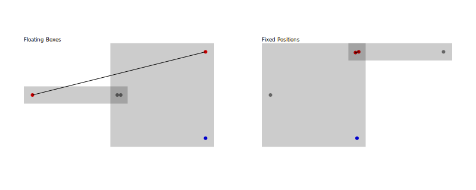
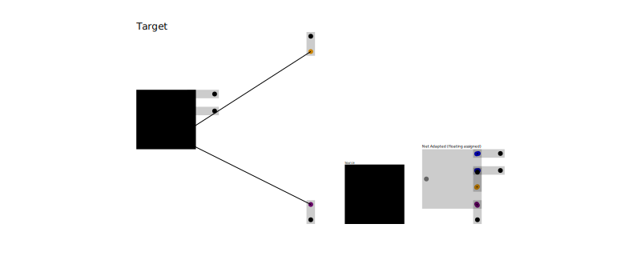
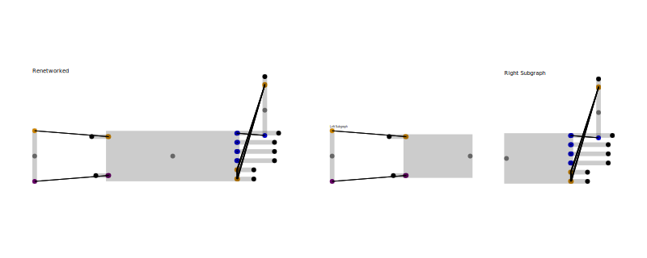

# bpc-graph

A box pin color (BPC) graph is a specialized graph structure where:

- Boxes contain pins
- Pins belong to a network
- Pins are coloured to describe signal type

Boxes can be **fixed** (they know their position) or **floating** (no position yet). Each
pin stores an offset relative to its box. When all pins on a network are visualised, a
schematic like connection graph is produced.

This repository provides utilities for manipulating and comparing BPC graphs.

## Contents

- [bpc-graph](#bpc-graph)
  - [Contents](#contents)
  - [Where BPC graphs are used](#where-bpc-graphs-are-used)
  - [Installation](#installation)
  - [Quick Example](#quick-example)
  - [Graph Utilities](#graph-utilities)
    - [assignFloatingBoxPositions(graph)](#assignfloatingboxpositionsgraph)
    - [netAdaptBpcGraph(source, target)](#netadaptbpcgraphsource-target)
    - [renetworkWithCondition(graph, predicate)](#renetworkwithconditiongraph-predicate)
    - [Conversion Utilities](#conversion-utilities)
    - [Similarity \& Layout](#similarity--layout)
  - [Partitioning](#partitioning)
    - [getBoxSideSubgraph({ bpcGraph, boxId, side })](#getboxsidesubgraph-bpcgraph-boxid-side-)
    - [mergeBoxSideSubgraphs(graphs)](#mergeboxsidesubgraphsgraphs)

## Where BPC graphs are used

When automatically laying out schematics the tools in this repo convert an initial
"floating" design into a fixed layout. Networks can be split, boxes can be adapted to a
template and the resulting graph can be rendered with a force directed solver.

<p align="center">
  
  
</p>

## Installation

```bash
bun add bpc-graph
```

## Quick Example

```ts
import { getGraphicsForBpcGraph } from "bpc-graph"
import { getSvgFromGraphicsObject } from "graphics-debug"

const graph = {
  boxes: [
    { boxId: "A", kind: "fixed", center: { x: 0, y: 0 } },
    { boxId: "B", kind: "fixed", center: { x: 2, y: 0 } },
  ],
  pins: [
    {
      boxId: "A",
      pinId: "P1",
      offset: { x: 0.5, y: 0 },
      color: "red",
      networkId: "N1",
    },
    {
      boxId: "A",
      pinId: "P2",
      offset: { x: 0.5, y: -0.5 },
      color: "blue",
      networkId: "N1",
    },
    {
      boxId: "B",
      pinId: "P1",
      offset: { x: -0.5, y: 0 },
      color: "red",
      networkId: "N1",
    },
    {
      boxId: "B",
      pinId: "CENTER",
      offset: { x: 0, y: 0 },
      color: "gray",
      networkId: "N2",
    },
  ],
}

const svg = getSvgFromGraphicsObject(getGraphicsForBpcGraph(graph), {
  backgroundColor: "white",
  includeTextLabels: true,
})
```


## Graph Utilities

- **getGraphBounds(graph)** → `{ minX, minY, maxX, maxY }`
- **getPinDirection(graph, boxId, pinId)** → `"x-" | "x+" | "y-" | "y+" | null`

### assignFloatingBoxPositions(graph)

Infers positions for floating boxes based on the positions of any connected pins

Starting with floating boxes (no fixed positions), the layout solver can automatically assign positions:

```ts
import { assignFloatingBoxPositions } from "bpc-graph"

const floatingGraph = {
  boxes: [
    { boxId: "A", kind: "floating" },
    { boxId: "B", kind: "floating" },
  ],
  pins: [
    /* ... */
  ],
}

// Convert floating boxes to fixed positions
const fixedGraph = assignFloatingBoxPositions(floatingGraph)
```

The image shows floating boxes (left) being automatically positioned into a fixed layout (right):



### netAdaptBpcGraph(source, target)

Adapt the source graph so that on a network, connection and pin count level it
matches the target graph. This function will insert or remove pins and boxes or
change network ids until there is a 1:1 matching for boxes and pins between the
source and target.

After net adapt, the graph will have floating boxes- we use `assignFloatingBoxPositions`
to infer positions for these boxes below.



### renetworkWithCondition(graph, predicate)

Change the networks of a graph based on a predicate.

```ts
const { renetworkedGraph } = renetworkWithCondition(
  ogGraph,
  (from, to, networkId) => {
    if (!from.box.center || !to.box.center) return true
    const fromSide =
      from.box.center.x + from.pin.offset.x < component0Center.x
        ? "left"
        : "right"
    const toSide =
      to.box.center.x + to.pin.offset.x < component0Center.x ? "left" : "right"
    return fromSide === toSide
  }
)
```


### Conversion Utilities

- **convertToFlatBpcGraph(mixed)** – flatten a BPC graph into nodes and undirected edges
- **convertFromFlatBpcGraph(flat)** – rebuild a mixed graph from the flat representation

### Similarity & Layout

- **getBpcGraphWlDistance(a, b)** – compute Weisfeiler-Leman distance between graphs
- **ForceDirectedLayoutSolver** – physics based solver for positioning boxes

All type definitions can be imported from `bpc-graph` as well and are located in
`lib/types.ts`.

## Partitioning

### getBoxSideSubgraph({ bpcGraph, boxId, side })

Get the subgraph of one side of a box with all connections



### mergeBoxSideSubgraphs(graphs)

Merge two subgraphs into a single graph
