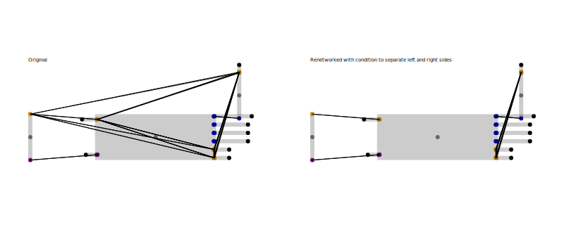
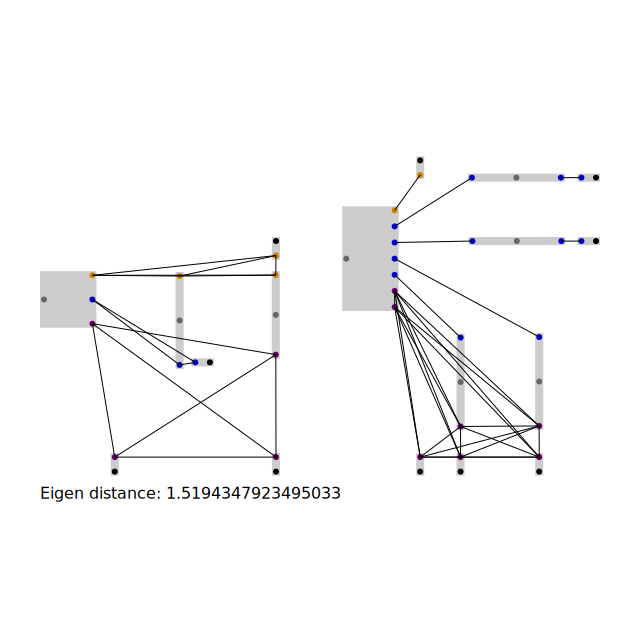
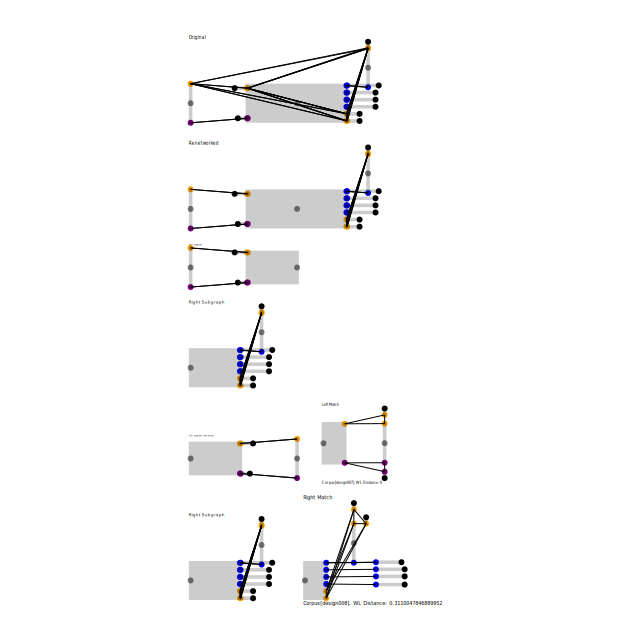

# bpc-graph

A box pin color (BPC) graph is a specialized graph structure where:

- Boxes contain pins
- Pins belong to a network
- Pins are coloured to describe signal type

Boxes can be **fixed** (they know their position) or **floating** (no position yet). Each
pin stores an offset relative to its box. When all pins on a network are visualised, a
schematic like connection graph is produced.

This repository provides utilities for manipulating and comparing BPC graphs.

## Contents

- [Where BPC graphs are used](#where-bpc-graphs-are-used)
- [Installation](#installation)
- [Quick Example](#quick-example)
- [API](#api)
  - [getGraphBounds](#getgraphboundsgraph)
  - [getPinPosition](#getpinpositiongraph-pinid)
  - [getPinDirection](#getpindirectiongraph-pinid)
  - [assignFloatingBoxPositions](#assignfloatingboxpositionsgraph)
  - [netAdaptBpcGraph](#netadaptbpcgraphsource-target)
  - [renetworkWithCondition](#renetworkwithconditiongraph-predicate)
  - [convertToFlatBpcGraph](#convertoflatbpcgraphmixed)
  - [convertFromFlatBpcGraph](#convertfromflatbpcgraphflat)
  - [getBpcGraphWlDistance](#getbpcgraphwldistancea-b)
  - [ForceDirectedLayoutSolver](#forcedirectedlayoutsolver)

## Where BPC graphs are used

When automatically laying out schematics the tools in this repo convert an initial
"floating" design into a fixed layout. Networks can be split, boxes can be adapted to a
template and the resulting graph can be rendered with a force directed solver.


## Installation

```bash
bun add bpc-graph
```

## Quick Example

```ts
import { getGraphicsForBpcGraph } from "bpc-graph"
import { getSvgFromGraphicsObject } from "graphics-debug"

const graph = {
  boxes: [
    { kind: "fixed", boxId: "A", center: { x: 0, y: 0 } },
    { kind: "fixed", boxId: "B", center: { x: 2, y: 0 } },
  ],
  pins: [
    { boxId: "A", pinId: "P1", offset: { x: 0.5, y: 0 }, color: "red", networkId: "N1" },
    { boxId: "B", pinId: "P1", offset: { x: -0.5, y: 0 }, color: "red", networkId: "N1" },
  ],
}

const svg = getSvgFromGraphicsObject(getGraphicsForBpcGraph(graph), { backgroundColor: "white" })
```

The snapshot generated in `tests/readme/getGraphicsExample.test.ts` renders as:


## API

### getGraphBounds(graph)


### getPinPosition(graph, pinId)

_See graph utils example above_

### getPinDirection(graph, pinId)

_See graph utils example above_

### assignFloatingBoxPositions(graph)


### netAdaptBpcGraph(source, target)


### renetworkWithCondition(graph, predicate)



### convertToFlatBpcGraph(mixed)


### convertFromFlatBpcGraph(flat)

_Result identical to original, see convert flat example above_

### getBpcGraphWlDistance(a, b)



### ForceDirectedLayoutSolver



All type definitions can be imported from `bpc-graph` as well and are located in
`lib/types.ts`.

